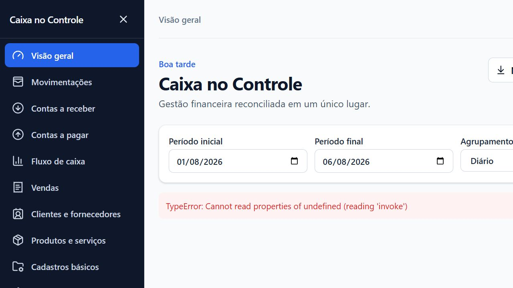
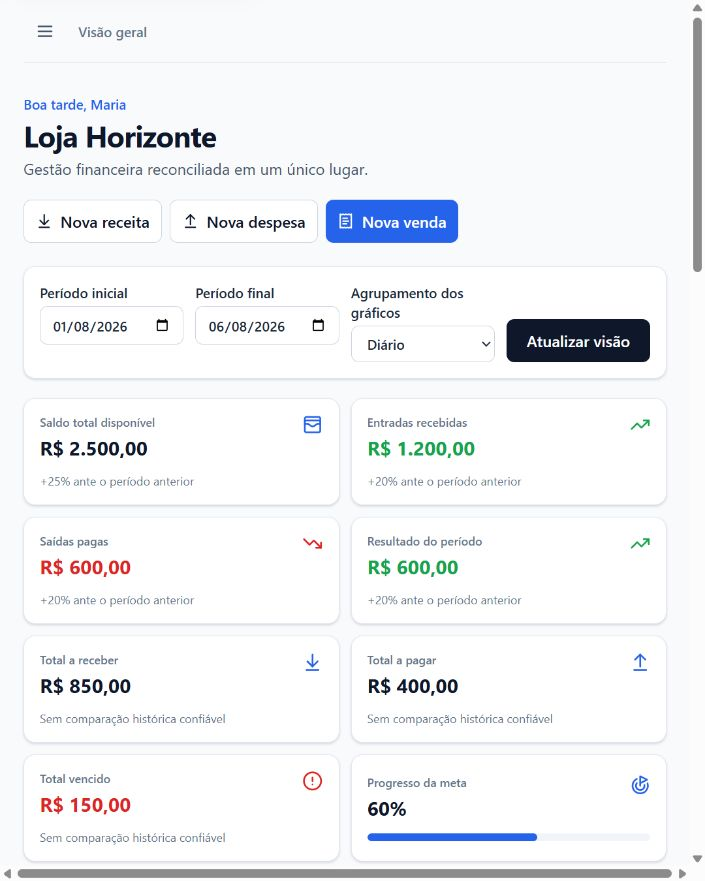
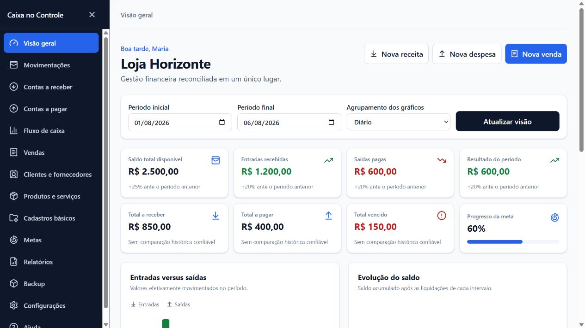

# Auditoria visual e de acessibilidade — Fase 9

Data: 06/08/2026

Saúde final: **saudável**. As falhas graves ou críticas encontradas nesta auditoria foram corrigidas e cobertas por regressão automatizada.

## 1. Estado inicial

O dashboard expunha `TypeError`/`invoke` quando a ponte nativa não estava disponível. A composição também não oferecia comportamento apropriado de gaveta em tela estreita.

## 2. Correções verificadas

- mensagens técnicas foram substituídas por orientação segura em português;
- menu virou gaveta acessível abaixo de 1024 px, com botão de abrir/fechar e fundo de proteção;
- link “Ir para o conteúdo principal”, foco completo e alvos mínimos foram adicionados;
- regiões de gráficos com rolagem passaram a aceitar teclado e informar sua finalidade;
- modais passaram a conter o foco, fechar com Escape e restaurar o controle anterior;
- contrastes de sucesso, erro, itens inativos e catálogo de relatórios foram elevados a WCAG AA;
- movimento reduzido é respeitado e os estados continuam descritos por texto, não apenas por cor.

## 3. Visão compacta

Medição da página: `clientWidth=705`, `scrollWidth=705`. O conteúdo principal não cria overflow horizontal; gráficos extensos possuem regiões internas identificadas e navegáveis.

## 4. Visão final

A hierarquia, filtros, ações, indicadores, valores, estados e gráficos permanecem legíveis com dados realistas. Axe não encontrou violações sérias ou críticas nos fluxos escaneados das Fases 2 a 9.

## Limites da evidência

A auditoria visual foi executada no navegador interno sobre a prévia de desenvolvimento com dados simulados. Persistência, comandos nativos e SQLite foram validados separadamente pelos testes Rust/E2E e pelo build Tauri; nenhum dado real do usuário foi usado.
